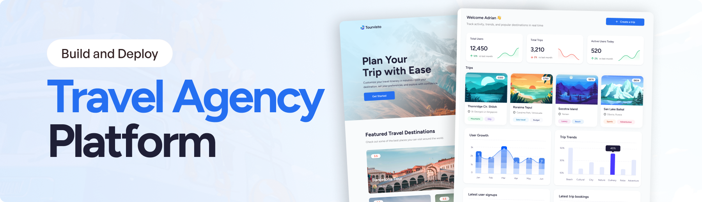

<div align="center">
  <br />
    <a href="https://www.youtube.com/watch?v=xZ1ba-RLrjo" target="_blank">
      
    </a>
  <br />
  <div>
    
    
    
    
  </div>
  <h3 align="center">Travel Agency Platform</h3>

  <div align="center">
     A modern travel agency platform with an admin dashboard and public site. Generate AI-powered trip itineraries based on country, travel style, interests, group type, and budget — and book trips with ease.

    
    </div>
</div>

## Features

- 🚀 Server-side rendering
- ⚡️ Hot Module Replacement (HMR)
- 📦 Asset bundling and optimization
- 🔄 Data loading and mutations
- 🔒 TypeScript by default
- 🎉 TailwindCSS for styling
- 📖 [React Router docs](https://reactrouter.com/)

## Getting Started

### Installation

Install the dependencies:

```bash
npm install
```

### Development

Start the development server with HMR:

```bash
npm run dev
```

Your application will be available at `http://localhost:5173`.

## Building for Production

Create a production build:

```bash
npm run build
```

## Deployment

### Docker Deployment

To build and run using Docker:

```bash
docker build -t my-app .

# Run the container
docker run -p 3000:3000 my-app
```

The containerized application can be deployed to any platform that supports Docker, including:

- AWS ECS
- Google Cloud Run
- Azure Container Apps
- Digital Ocean App Platform
- Fly.io
- Railway

### DIY Deployment

If you're familiar with deploying Node applications, the built-in app server is production-ready.

Make sure to deploy the output of `npm run build`

```
├── package.json
├── package-lock.json (or pnpm-lock.yaml, or bun.lockb)
├── build/
│   ├── client/    # Static assets
│   └── server/    # Server-side code
```

## Styling

This template comes with [Tailwind CSS](https://tailwindcss.com/) already configured for a simple default starting experience. You can use whatever CSS framework you prefer.

---

Built with ❤️ using React Router.
